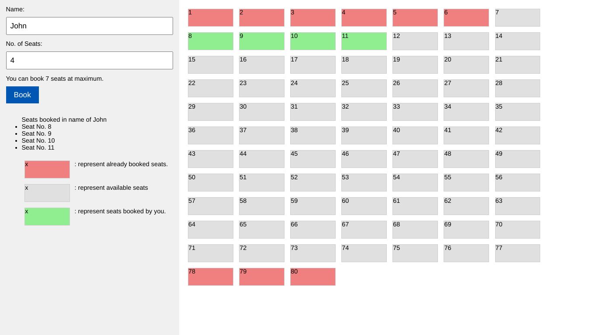

<h1 align="center" id="title">Coach Booking System</h1>

<p id="description">Coach booking system is a online system to book seats in a coach of 80 seats.</p>

<p align="center"></p>

<h2>Project Screenshots:</h2>




  

<h2>🛠️ Installation Steps (Linux):</h2>

<p>1. Installing the client packages</p>


```
npm install
```

<p>4. starting the server on localhost</p>

```
node index.js
```


  
  
<h2>💻 Built with</h2>

Technologies used in the project:
*HTML5
*CSS3
*JavaScript
*   Nodejs
*   Express js
